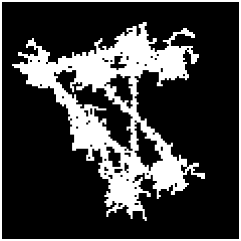
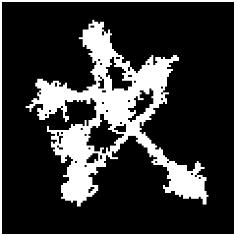
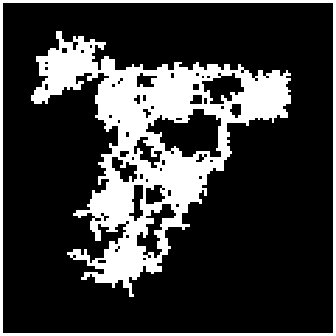

##Simple Cave Proc Gen
___
###What is it?
This is a simple, numpy based cave generator for games built in python. 
###How does it work?
The generator uses a mix of A* and Drunkards walk to generate a cave. 
The steps are as follows:
- create the map grid
- create a number of random starting points for the larger caves
- iteratively use drunkards walk to create the larger caves at the starting points
- use A* to connect the larger caves, using drunkards walk at each step of the path, 
using random heuristic functions from a list to increase variation
- validates that all starting points are connected, this makes sure that the whole system is connected
if this fails recursively generate a new map, this is fast and fairly cheap

###How do I use it?

```python
from cave_carver import make_caves

caves = make_caves(
    size=(120, 120),
    num_rooms=7,
    num_corridors=9,
    room_min_steps=30,
    room_max_steps=80,
    room_iterations=30,
    room_max_distance_from_start=None,
    corridor_min_steps=3,
    corridor_max_staps=10,
    corridor_max_distance_from_start=6,
    border_padding=20,
    carvable_values=[0, 1],
    passable_values=[1],
    carve_value=1,
    heuristic_methods=['euclidean', 'octile', 'manhattan', 'chebyshev'],
    max_attempts=100,
    min_room_distance=20
)
```
This will retry the defined number of times if it is not able to validate the map.It shouldn't need to retry too many 
if your settings are relatively balanced  


###What does it look like?





